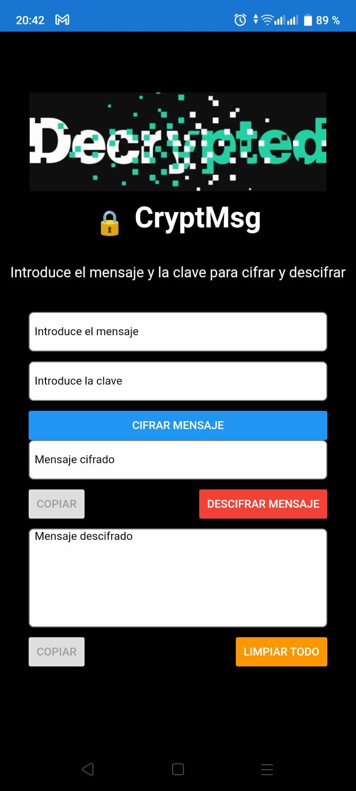

CryptMsg

CryptMsg es una aplicación móvil de cifrado y descifrado de mensajes, desarrollada con React Native. La aplicación permite a los usuarios cifrar y descifrar mensajes utilizando una clave secreta. Los usuarios pueden copiar fácilmente los mensajes cifrados y descifrados en el portapapeles para compartirlos con otros.

Características

Cifrado y descifrado de mensajes utilizando el algoritmo AES.
Copiar mensajes cifrados y descifrados en el portapapeles.
Validación de la clave secreta antes de descifrar.
Función de limpiar todo para borrar todos los campos de entrada.
Diseño responsivo y atractivo.

Requisitos

Node.js v14.x.x o superior
React Native v0.66.x o superior
Dispositivo Android o iOS, o emulador para pruebas

Instalación

Clona este repositorio:
    
    git clone https://github.com/yourusername/cryptmsg.git

Instala las dependencias:
    
    cd cryptmsg
    npm install
        
   
Ejecuta la aplicación en un emulador o dispositivo:

Para Android:

    npx react-native run-android
    
Para iOS:

    npx react-native run-ios

Uso:

Abre la aplicación en tu dispositivo o emulador.
Ingresa el mensaje que deseas cifrar en el campo "Introduce el mensaje".
Ingresa la clave secreta en el campo "Introduce la clave".
Presiona el botón "Cifrar mensaje" para cifrar el mensaje.
El mensaje cifrado aparecerá en el campo "Mensaje cifrado".
Puedes copiar el mensaje cifrado al portapapeles presionando el botón "Copiar".
Para descifrar el mensaje, ingresa la clave secreta correcta y presiona el botón "Descifrar mensaje".
El mensaje descifrado aparecerá en el campo "Mensaje descifrado".
Puedes copiar el mensaje descifrado al portapapeles presionando el botón "Copiar".
Usa el botón "Limpiar todo" para borrar todos los campos de entrada y comenzar de nuevo.

